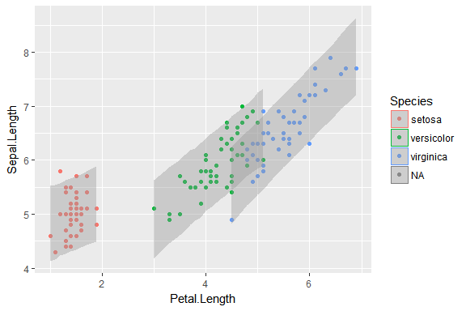

<!-- README.md is generated from README.Rmd. Please edit that file -->
tristan [](http://www.repostatus.org/#wip)
====================================================================================================================================================================================================================================

This package contains my helper functions for working with models fit with RStanARM. The package is named tristan because I'm working with Stan samples and my name is Tristan.

I plan to incrementally update this package whenever I find myself solving the same old problems from an RStanARM model.

Installation
------------

You can install tristan from github with:

``` r
# install.packages("devtools")
devtools::install_github("tjmahr/tristan")
```

A simple RStanARM model
-----------------------

Let's fit a simple linear model.

``` r
library(tidyverse)
library(rstanarm)
library(tristan)

# Scaling makes the model run much faster
scale_v <- function(...) as.vector(scale(...))
iris$z.Sepal.Length <- scale_v(iris$Sepal.Length)
iris$z.Petal.Length <- scale_v(iris$Petal.Length)

iris[2, "Species"] <- NA

model <- stan_glm(
  z.Sepal.Length ~ z.Petal.Length * Species,
  data = iris,
  family = gaussian(),
  prior = normal(0, 2))
```

Let's plot some samples of the model's linear prediction for the mean. If classical model provide a single "line of best fit", Bayesian models provide a distribution "lines of plausible fit". We'd like to visualize 100 of these lines alongside the data.

In classical models, getting the fitted values is easily done by adding a column of `fitted()` values to dataframe or using `predict()` on some new observations. (In `broom` terminology, `augment()` the data-set with model predictions.)

Because the posterior of this model contains 4000 such fitted or predicted values, more data wrangling and reshaping is required. `augment_posterior_linpred()` automates this task by producing a long dataframe with one row per posterior fitted value.

Here, we tell the model that we want just 100 of the lines.

``` r
# Get the fitted means of the data for 100 samples of the posterior distribution
data_with_linpreds <- augment_posterior_linpred(
  model = model, 
  newdata = iris, 
  nsamples = 100)
data_with_linpreds
#> # A tibble: 14,900 × 10
#>    ..obs PosteriorDraw PosteriorLinPred Sepal.Length Sepal.Width
#>    <int>         <int>            <dbl>        <dbl>       <dbl>
#> 1      1            72       -1.0148344          5.1         3.5
#> 2      1             5       -1.0661607          5.1         3.5
#> 3      1            10       -1.0342837          5.1         3.5
#> 4      1            14       -1.0305309          5.1         3.5
#> 5      1            96       -1.0196355          5.1         3.5
#> 6      1            34       -0.8913152          5.1         3.5
#> 7      1            90       -1.0659340          5.1         3.5
#> 8      1            53       -1.0175056          5.1         3.5
#> 9      1            97       -1.0756757          5.1         3.5
#> 10     1            30       -1.0809511          5.1         3.5
#> # ... with 14,890 more rows, and 5 more variables: Petal.Length <dbl>,
#> #   Petal.Width <dbl>, Species <fctr>, z.Sepal.Length <dbl>,
#> #   z.Petal.Length <dbl>
```

To plot the lines, we have to unscale the model's fitted values.

``` r
unscale <- function(scaled, original) {
  (scaled * sd(original, na.rm = TRUE)) + mean(original, na.rm = TRUE)
}

data_with_linpreds$PosteriorLinPred <- unscale(
  scaled = data_with_linpreds$PosteriorLinPred, 
  original = iris$Sepal.Length)
```

Now, we can do a spaghetti plot of linear predictions.

``` r
ggplot(iris) + 
  aes(x = Petal.Length, y = Sepal.Length, color = Species) + 
  geom_point() + 
  geom_line(aes(y = PosteriorLinPred, group = interaction(Species, PosteriorDraw)), 
            data = data_with_linpreds, alpha = .20)
```


`augment_posterior_predict()` similarly tidies values from the `posterior_predict()` function. `posterior_predict()` incorporates the error terms from the model, so it can be used predict new fake data from the model.

Below, we can inspect whether 95% of the data falls inside the 95% interval of posterior-predicted values.

``` r
# Get the fitted means of the data for 100 samples of the posterior distribution
posterior_preds <- augment_posterior_predict(
  model = model, 
  newdata = iris)
posterior_preds
#> # A tibble: 596,000 × 10
#>    ..obs PosteriorDraw PosteriorPred Sepal.Length Sepal.Width Petal.Length
#>    <int>         <int>         <dbl>        <dbl>       <dbl>        <dbl>
#> 1      1             1    -0.5487679          5.1         3.5          1.4
#> 2      1             2    -0.5736016          5.1         3.5          1.4
#> 3      1             3    -0.7999946          5.1         3.5          1.4
#> 4      1             4    -1.0044920          5.1         3.5          1.4
#> 5      1             5    -1.0299800          5.1         3.5          1.4
#> 6      1             6    -1.6915048          5.1         3.5          1.4
#> 7      1             7    -0.1846787          5.1         3.5          1.4
#> 8      1             8    -1.3902978          5.1         3.5          1.4
#> 9      1             9    -0.8894498          5.1         3.5          1.4
#> 10     1            10    -2.1690012          5.1         3.5          1.4
#> # ... with 595,990 more rows, and 4 more variables: Petal.Width <dbl>,
#> #   Species <fctr>, z.Sepal.Length <dbl>, z.Petal.Length <dbl>

posterior_preds$PosteriorPred <- unscale(
  scaled = posterior_preds$PosteriorPred, 
  original = iris$Sepal.Length)
```

``` r
ggplot(iris) + 
  aes(x = Petal.Length, y = Sepal.Length, color = Species) + 
  geom_point() + 
  stat_summary(aes(y = PosteriorPred, group = Species, color = NULL), 
               data = posterior_preds, alpha = 0.4, fill = "grey60", 
               geom = "ribbon", 
               fun.data = median_hilow, fun.args = list(conf.int = .95))
```


