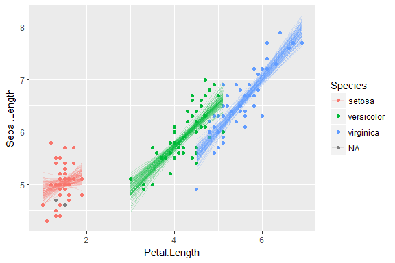

<!-- README.md is generated from README.Rmd. Please edit that file -->
tristan [](http://www.repostatus.org/#wip)
====================================================================================================================================================================================================================================

This package contains my helper functions for working with models fit with RStanARM. The package is named tristan because I'm working with Stan samples and my name is Tristan.

I plan to incrementally update this package whenever I find myself solving the same old problems from an RStanARM model.

Installation
------------

You can install tristan from github with:

``` r
# install.packages("devtools")
devtools::install_github("tjmahr/tristan")
```

Overview of helpers
-------------------

`augment_posterior_predict()` and `augment_posterior_linpred()` generate new data predictions and fitted means for new datasets using RStanARM's `posterior_predict()` and `posterior_linpred()`. The RStanARM functions return giant matrices of predicted values, but these functions return a long data-frame of predicted values along with the values of the predictor variables. The name *augment* follows the convention of the broom package where `augment()` refers to augmenting a data-set with model predictions.

Example
-------

Fit a simple linear model.

``` r
library(tidyverse)
library(rstanarm)
library(tristan)

# Scaling makes the model run much faster
scale_v <- function(...) as.vector(scale(...))
iris$z.Sepal.Length <- scale_v(iris$Sepal.Length)
iris$z.Petal.Length <- scale_v(iris$Petal.Length)

# Just to ensure that NA values don't break the prediction function
iris[2:6, "Species"] <- NA

model <- stan_glm(
  z.Sepal.Length ~ z.Petal.Length * Species,
  data = iris,
  family = gaussian(),
  prior = normal(0, 2))
```

### Posterior linear predictions (expected values)

Let's plot some samples of the model's linear prediction for the mean. If classical model provide a single "line of best fit", Bayesian models provide a distribution "lines of plausible fit". We'd like to visualize 100 of these lines alongside the raw data.

In classical models, getting the fitted values is easily done by adding a column of `fitted()` values to dataframe or using `predict()` on some new observations.

Because the posterior of this model contains 4000 such fitted or predicted values, more data wrangling and reshaping is required. `augment_posterior_linpred()` automates this task by producing a long dataframe with one row per posterior fitted value.

Here, we tell the model that we want just 100 of those lines (i.e., 100 samples from the posterior distribution).

``` r
# Get the fitted means of the data for 100 samples of the posterior distribution
linear_preds <- augment_posterior_linpred(
  model = model, 
  newdata = iris, 
  nsamples = 100)
linear_preds
#> # A tibble: 14,500 × 10
#>    .observation .draw .posterior_value Sepal.Length Sepal.Width
#>           <int> <int>            <dbl>        <dbl>       <dbl>
#> 1             1     1       -1.0432837          5.1         3.5
#> 2             1     2       -1.0005566          5.1         3.5
#> 3             1     3       -1.1015455          5.1         3.5
#> 4             1     4       -0.9971867          5.1         3.5
#> 5             1     5       -1.0668197          5.1         3.5
#> 6             1     6       -0.9760993          5.1         3.5
#> 7             1     7       -1.0638527          5.1         3.5
#> 8             1     8       -0.8788901          5.1         3.5
#> 9             1     9       -1.0069192          5.1         3.5
#> 10            1    10       -0.9800662          5.1         3.5
#> # ... with 14,490 more rows, and 5 more variables: Petal.Length <dbl>,
#> #   Petal.Width <dbl>, Species <fctr>, z.Sepal.Length <dbl>,
#> #   z.Petal.Length <dbl>
```

To plot the lines, we have to unscale the model's fitted values.

``` r
unscale <- function(scaled, original) {
  (scaled * sd(original, na.rm = TRUE)) + mean(original, na.rm = TRUE)
}

linear_preds$.posterior_value <- unscale(
  scaled = linear_preds$.posterior_value, 
  original = iris$Sepal.Length)
```

Now, we can do a spaghetti plot of linear predictions.

``` r
ggplot(iris) + 
  aes(x = Petal.Length, y = Sepal.Length, color = Species) + 
  geom_point() + 
  geom_line(aes(y = .posterior_value, group = interaction(Species, .draw)), 
            data = linear_preds, alpha = .20)
```



### Posterior predictions (simulated new data)

`augment_posterior_predict()` similarly tidies values from the `posterior_predict()` function. `posterior_predict()` incorporates the error terms from the model, so it can be used predict new fake data from the model.

Let's create a range of values within each species, and get posterior predicted values.

``` r
library(modelr)

# Within each species, generate a sequence of z.Petal.Length values
newdata <- iris %>% 
  group_by(Species) %>% 
  # Expand a bit so that the points to bulge out left/right sides of the
  # uncertainty ribbon
  data_grid(z.Petal.Length = z.Petal.Length %>% 
              seq_range(n = 80, expand = .10)) %>% 
  ungroup()

newdata$Petal.Length <- unscale(newdata$z.Petal.Length, iris$Petal.Length)

# Get posterior predictions
posterior_preds <- augment_posterior_predict(model, newdata)
posterior_preds
#> # A tibble: 960,000 × 6
#>    .observation .draw .posterior_value Species z.Petal.Length Petal.Length
#>           <int> <int>            <dbl>  <fctr>          <dbl>        <dbl>
#> 1             1     1      -2.38982730  setosa      -1.587834        0.955
#> 2             1     2      -1.03517975  setosa      -1.587834        0.955
#> 3             1     3      -1.08341356  setosa      -1.587834        0.955
#> 4             1     4      -0.26876517  setosa      -1.587834        0.955
#> 5             1     5      -1.03284341  setosa      -1.587834        0.955
#> 6             1     6      -1.14590049  setosa      -1.587834        0.955
#> 7             1     7      -1.52877394  setosa      -1.587834        0.955
#> 8             1     8      -0.05161558  setosa      -1.587834        0.955
#> 9             1     9      -1.37156287  setosa      -1.587834        0.955
#> 10            1    10      -2.10312155  setosa      -1.587834        0.955
#> # ... with 959,990 more rows

posterior_preds$.posterior_value <- unscale(
  scaled = posterior_preds$.posterior_value, 
  original = iris$Sepal.Length)
```

Take a second to appreciate the size of that table. It has 4000 predictions for each the 320 observations in `newdata`.

Now, we can inspect whether 95% of the data falls inside the 95% interval of posterior-predicted values.

``` r
ggplot(iris) + 
  aes(x = Petal.Length, y = Sepal.Length, color = Species) + 
  geom_point() + 
  stat_summary(aes(y = .posterior_value, group = Species, color = NULL), 
               data = posterior_preds, alpha = 0.4, fill = "grey60", 
               geom = "ribbon", 
               fun.data = median_hilow, fun.args = list(conf.int = .95))
```


### ggmc support

ggmc provides [a lot of magic](http://xavier-fim.net/packages/ggmcmc/#importing-mcmc-samples-into-ggmcmc-using-ggs). The general ggmcmc workflow is to create a tidy dataframe using `ggs()` and plug it that into the package's plotting functions. For example, here is how we can inspect the each parameter value using histograms.

``` r
library(ggmcmc)
gg_model <- ggs(model)
  
ggs_histogram(gg_model) + facet_wrap("Parameter", scales = "free_x")
```


It's a magic one-liner. The `facet_wrap()` is just a tweak to put things in a grid instead of single column. But look, the plot lost the names of parameters from the model!

`ggs_rstanarm()` is a small function that imitates the output of `ggs()` but tries to keep the original parameter names. That means that it drops the generated quantity `"mean_PPD"` as well.

``` r
gg_model2 <- ggs_rstanarm(model)
  
ggs_histogram(gg_model2) + facet_wrap("Parameter", scales = "free_x")
```


