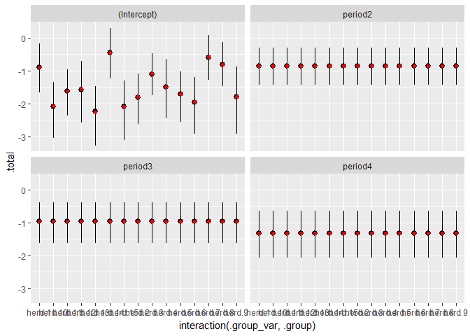

<!-- README.md is generated from README.Rmd. Please edit that file -->
tristan [](http://www.repostatus.org/#wip)
====================================================================================================================================================================================================================================

This package contains my helper functions for working with models fit with RStanARM. The package is named tristan because I'm working with Stan samples and my name is Tristan.

I plan to incrementally update this package whenever I find myself solving the same old problems from an RStanARM model.

Installation
------------

You can install tristan from github with:

``` r
# install.packages("devtools")
devtools::install_github("tjmahr/tristan")
```

Overview of helpers
-------------------

`augment_posterior_predict()` and `augment_posterior_linpred()` generate new data predictions and fitted means for new datasets using RStanARM's `posterior_predict()` and `posterior_linpred()`. The RStanARM functions return giant matrices of predicted values, but these functions return a long dataframe of predicted values along with the values of the predictor variables. The name *augment* follows the convention of the broom package where `augment()` refers to augmenting a data-set with model predictions.

`stan_to_lm()` and `stan_to_glm()` provide a quick way to refit an RStanARM model with its classical counterpart.

The `ggs()` function in the ggmcmc package produces a tidy dataframe of MCMC samples. That function doesn't return the original parameter names for RStanARM models. `ggs_rstanarm()` rectifies this problem.

Example
-------

Fit a simple linear model.

``` r
library(tidyverse)
library(rstanarm)
library(tristan)

# Scaling makes the model run much faster
scale_v <- function(...) as.vector(scale(...))
iris$z.Sepal.Length <- scale_v(iris$Sepal.Length)
iris$z.Petal.Length <- scale_v(iris$Petal.Length)

# Just to ensure that NA values don't break the prediction function
iris[2:6, "Species"] <- NA

model <- stan_glm(
  z.Sepal.Length ~ z.Petal.Length * Species,
  data = iris,
  family = gaussian(),
  prior = normal(0, 2))
```

``` r
print(model)
#> stan_glm
#>  family:  gaussian [identity]
#>  formula: z.Sepal.Length ~ z.Petal.Length * Species
#> ------
#> 
#> Estimates:
#>                                  Median MAD_SD
#> (Intercept)                       0.0    0.6  
#> z.Petal.Length                    0.8    0.5  
#> Speciesversicolor                -0.4    0.7  
#> Speciesvirginica                 -1.3    0.7  
#> z.Petal.Length:Speciesversicolor  1.0    0.5  
#> z.Petal.Length:Speciesvirginica   1.3    0.6  
#> sigma                             0.4    0.0  
#> 
#> Sample avg. posterior predictive 
#> distribution of y (X = xbar):
#>          Median MAD_SD
#> mean_PPD 0.0    0.0   
#> 
#> ------
#> For info on the priors used see help('prior_summary.stanreg').
```

### Posterior fitted values (linear predictions)

Let's plot some samples of the model's linear prediction for the mean. If classical model provide a single "line of best fit", Bayesian models provide a distribution "lines of plausible fit". We'd like to visualize 100 of these lines alongside the raw data.

In classical models, getting the fitted values is easily done by adding a column of `fitted()` values to dataframe or using `predict()` on some new observations.

Because the posterior of this model contains 4000 such fitted or predicted values, more data wrangling and reshaping is required. `augment_posterior_linpred()` automates this task by producing a long dataframe with one row per posterior fitted value.

Here, we tell the model that we want just 100 of those lines (i.e., 100 samples from the posterior distribution).

``` r
# Get the fitted means of the data for 100 samples of the posterior distribution
linear_preds <- augment_posterior_linpred(
  model = model, 
  newdata = iris, 
  nsamples = 100)
linear_preds
#> # A tibble: 14,500 x 10
#>    .observation .draw .posterior_value Sepal.Length Sepal.Width
#>           <int> <int>            <dbl>        <dbl>       <dbl>
#>  1            1     1       -0.9315514          5.1         3.5
#>  2            1     2       -0.9565635          5.1         3.5
#>  3            1     3       -0.8873909          5.1         3.5
#>  4            1     4       -1.0384317          5.1         3.5
#>  5            1     5       -1.0680745          5.1         3.5
#>  6            1     6       -0.9813867          5.1         3.5
#>  7            1     7       -1.0067503          5.1         3.5
#>  8            1     8       -1.1124061          5.1         3.5
#>  9            1     9       -1.0205787          5.1         3.5
#> 10            1    10       -0.9786489          5.1         3.5
#> # ... with 14,490 more rows, and 5 more variables: Petal.Length <dbl>,
#> #   Petal.Width <dbl>, Species <fctr>, z.Sepal.Length <dbl>,
#> #   z.Petal.Length <dbl>
```

To plot the lines, we have to unscale the model's fitted values.

``` r
unscale <- function(scaled, original) {
  (scaled * sd(original, na.rm = TRUE)) + mean(original, na.rm = TRUE)
}

linear_preds$.posterior_value <- unscale(
  scaled = linear_preds$.posterior_value, 
  original = iris$Sepal.Length)
```

Now, we can do a spaghetti plot of linear predictions.

``` r
ggplot(iris) + 
  aes(x = Petal.Length, y = Sepal.Length, color = Species) + 
  geom_point() + 
  geom_line(aes(y = .posterior_value, group = interaction(Species, .draw)), 
            data = linear_preds, alpha = .20)
```


### Posterior predictions (simulated new data)

`augment_posterior_predict()` similarly tidies values from the `posterior_predict()` function. `posterior_predict()` incorporates the error terms from the model, so it can be used predict new fake data from the model.

Let's create a range of values within each species, and get posterior predictions for those values.

``` r
library(modelr)

# Within each species, generate a sequence of z.Petal.Length values
newdata <- iris %>% 
  group_by(Species) %>% 
  # Expand the range x value a little bit so that the points do not bulge out
  # left/right sides of the uncertainty ribbon in the plot
  data_grid(z.Petal.Length = z.Petal.Length %>% 
              seq_range(n = 80, expand = .10)) %>% 
  ungroup()

newdata$Petal.Length <- unscale(newdata$z.Petal.Length, iris$Petal.Length)

# Get posterior predictions
posterior_preds <- augment_posterior_predict(model, newdata)
posterior_preds
#> # A tibble: 960,000 x 6
#>    .observation .draw .posterior_value Species z.Petal.Length Petal.Length
#>           <int> <int>            <dbl>  <fctr>          <dbl>        <dbl>
#>  1            1     1       -1.3809285  setosa      -1.587834        0.955
#>  2            1     2       -1.0053184  setosa      -1.587834        0.955
#>  3            1     3       -2.0321063  setosa      -1.587834        0.955
#>  4            1     4       -1.1646054  setosa      -1.587834        0.955
#>  5            1     5       -1.1044528  setosa      -1.587834        0.955
#>  6            1     6       -0.9158609  setosa      -1.587834        0.955
#>  7            1     7       -0.8546550  setosa      -1.587834        0.955
#>  8            1     8       -1.6653748  setosa      -1.587834        0.955
#>  9            1     9       -1.5790256  setosa      -1.587834        0.955
#> 10            1    10       -1.5077607  setosa      -1.587834        0.955
#> # ... with 959,990 more rows

posterior_preds$.posterior_value <- unscale(
  scaled = posterior_preds$.posterior_value, 
  original = iris$Sepal.Length)
```

Take a second to appreciate the size of that table. It has 4000 predictions for each the 320 observations in `newdata`.

Now, we might inspect whether 95% of the data falls inside the 95% interval of posterior-predicted values (among other questions we could ask the model.)

``` r
ggplot(iris) + 
  aes(x = Petal.Length, y = Sepal.Length, color = Species) + 
  geom_point() + 
  stat_summary(aes(y = .posterior_value, group = Species, color = NULL), 
               data = posterior_preds, alpha = 0.4, fill = "grey60", 
               geom = "ribbon", 
               fun.data = median_hilow, fun.args = list(conf.int = .95))
```


### Refit RStanARM models with classical counterparts

There are some quick functions for refitting RStanARM models using classical versions. These functions basically inject the values of `model$formula` and `model$data` into `lm()` or `glm()`. (Seriously, see the call sections in the two outputs below.) Therefore, don't use these functions for serious comparisons of classical versus Bayesian models.

Refit with a linear model:

``` r
arm::display(stan_to_lm(model))
#> Please manually fit model if original model used any 
#> arguments besides `formula` and `data`.
#> stats::lm(formula = stats::formula(model), data = model$data, 
#>     weights = if (length(model$weights) == 0) NULL else model$weights, 
#>     offset = model$offset)
#>                                  coef.est coef.se
#> (Intercept)                       0.33     0.80  
#> z.Petal.Length                    1.03     0.61  
#> Speciesversicolor                -0.72     0.81  
#> Speciesvirginica                 -1.59     0.83  
#> z.Petal.Length:Speciesversicolor  0.74     0.65  
#> z.Petal.Length:Speciesvirginica   1.10     0.64  
#> ---
#> n = 145, k = 6
#> residual sd = 0.41, R-Squared = 0.84
```

Refit with a generalized linear model:

``` r
arm::display(stan_to_glm(model))
#> Please manually fit model if original model used any 
#> arguments besides `formula`, `family`, and `data`.
#> stats::glm(formula = stats::formula(model), family = model$family, 
#>     data = model$data, weights = if (length(model$weights) == 
#>         0) NULL else model$weights, offset = model$offset)
#>                                  coef.est coef.se
#> (Intercept)                       0.33     0.80  
#> z.Petal.Length                    1.03     0.61  
#> Speciesversicolor                -0.72     0.81  
#> Speciesvirginica                 -1.59     0.83  
#> z.Petal.Length:Speciesversicolor  0.74     0.65  
#> z.Petal.Length:Speciesvirginica   1.10     0.64  
#> ---
#>   n = 145, k = 6
#>   residual deviance = 23.3, null deviance = 142.0 (difference = 118.7)
#>   overdispersion parameter = 0.2
#>   residual sd is sqrt(overdispersion) = 0.41
```

### ggmc support

ggmc provides [a lot of magic](http://xavier-fim.net/packages/ggmcmc/#importing-mcmc-samples-into-ggmcmc-using-ggs). The general ggmcmc workflow is to create a tidy dataframe using `ggs()` and plug it that into the package's plotting functions. For example, here is how we can inspect the each parameter value using histograms and interval plots.

``` r
library(ggmcmc)
gg_model <- ggs(model)
  
# Facet wrap so that values are in a grid, not a single column.
ggs_histogram(gg_model) + 
  facet_wrap("Parameter", scales = "free_x")

# Remap y-aesthetic so that the parameters read from top-to-bottom in their
# original factor ordering.
ggs_caterpillar(gg_model, line = 0) + 
  aes(y = forcats::fct_rev(Parameter)) + 
  ylab(NULL)
```


The package is magically convenient. But look, the plot lost the names of parameters from the model!

`ggs_rstanarm()` is a small function that imitates the output of `ggs()` but tries to keep the original parameter names. It also drops the non-parameter `"mean_PPD"` (the model's prediction for a completely average observation.)

``` r
gg_model2 <- ggs_rstanarm(model)

ggs_histogram(gg_model2) + 
  facet_wrap("Parameter", scales = "free_x")

ggs_caterpillar(gg_model2, line = 0) + 
  aes(y = forcats::fct_rev(Parameter)) + 
  ylab(NULL)
```


### Calculate (classical) *R*<sup>2</sup>

`calculate_classical_r2()` returns the unadjusted *R*<sup>2</sup> for each draw of the posterior distribution.

``` r
df_r2 <- data_frame(
  R2 = calculate_model_r2(model)
)
df_r2
#> # A tibble: 4,000 x 1
#>           R2
#>        <dbl>
#>  1 0.8269287
#>  2 0.8286182
#>  3 0.8309418
#>  4 0.8337803
#>  5 0.8316979
#>  6 0.8295612
#>  7 0.8325530
#>  8 0.8318201
#>  9 0.8276650
#> 10 0.8280340
#> # ... with 3,990 more rows
```

### Interval calculation

Two more helper functions compute tidy data-frames of posterior density intervals. `tidy_hpdi()` provides the highest-density posterior interval for model parameters, while `tidy_etdi()` computes the equal-tailed density intervals (the typical sort of intervals used for uncertain intervals.)

``` r
tidy_hpdi(model)
#> # A tibble: 7 x 5
#>                               term interval density       lower      upper
#>                              <chr>    <chr>   <dbl>       <dbl>      <dbl>
#> 1                      (Intercept)     HPDI     0.9 -1.03894068  1.0757546
#> 2                   z.Petal.Length     HPDI     0.9  0.03453807  1.6560589
#> 3                Speciesversicolor     HPDI     0.9 -1.42748700  0.6884022
#> 4                 Speciesvirginica     HPDI     0.9 -2.38524882 -0.2048360
#> 5 z.Petal.Length:Speciesversicolor     HPDI     0.9  0.06651501  1.8544207
#> 6  z.Petal.Length:Speciesvirginica     HPDI     0.9  0.46379409  2.2085139
#> 7                            sigma     HPDI     0.9  0.37288522  0.4534112
tidy_etdi(model)
#> # A tibble: 7 x 5
#>                               term interval density       lower      upper
#>                              <chr>    <chr>   <dbl>       <dbl>      <dbl>
#> 1                      (Intercept)     ETDI     0.9 -1.01524062  1.1076903
#> 2                   z.Petal.Length     ETDI     0.9 -0.01548979  1.6149531
#> 3                Speciesversicolor     ETDI     0.9 -1.49737884  0.6347173
#> 4                 Speciesvirginica     ETDI     0.9 -2.37986191 -0.1925737
#> 5 z.Petal.Length:Speciesversicolor     ETDI     0.9  0.07317261  1.8652106
#> 6  z.Petal.Length:Speciesvirginica     ETDI     0.9  0.44271242  2.1940697
#> 7                            sigma     ETDI     0.9  0.37262531  0.4531580
```

The functions also work on single vectors of numbers, for quick one-off calculations.

``` r
r2_intervals <- bind_rows(
  tidy_hpdi(calculate_model_r2(model)),
  tidy_etdi(calculate_model_r2(model))
)
r2_intervals
#> # A tibble: 2 x 5
#>                        term interval density     lower     upper
#>                       <chr>    <chr>   <dbl>     <dbl>     <dbl>
#> 1 calculate_model_r2(model)     HPDI     0.9 0.8234095 0.8349006
#> 2 calculate_model_r2(model)     ETDI     0.9 0.8211217 0.8338705
```

We can compare the difference between highest-posterior density intervals and equal-tailed intervals.

``` r
ggplot(df_r2) + 
  aes(x = R2) + 
  geom_histogram() + 
  geom_vline(aes(xintercept = lower, color = interval), 
             data = r2_intervals, size = 1, linetype = "dashed") + 
  geom_vline(aes(xintercept = upper, color = interval), 
             data = r2_intervals, size = 1, linetype = "dashed") +
  labs(color = "90% interval",
       x = expression(R^2),
       y = "Num. posterior samples")
#> `stat_bin()` using `bins = 30`. Pick better value with `binwidth`.
```


Pure sugar
----------

`double_etdi()` that provides all the values needed to make a double interval (caterpillar) plot.

``` r
df1 <- double_etdi(calculate_model_r2(model), .95, .90)
df2 <- double_etdi(model, .95, .90)
df <- bind_rows(df1, df2)
df
#> # A tibble: 8 x 9
#>                               term outer_lower inner_lower     estimate
#>                              <chr>       <dbl>       <dbl>        <dbl>
#> 1        calculate_model_r2(model)   0.8189694  0.82112172  0.829535546
#> 2                      (Intercept)  -1.2148612 -1.01524062  0.006074363
#> 3                   z.Petal.Length  -0.1528441 -0.01548979  0.780169581
#> 4                Speciesversicolor  -1.6635555 -1.49737884 -0.395108335
#> 5                 Speciesvirginica  -2.5544321 -2.37986191 -1.256114326
#> 6 z.Petal.Length:Speciesversicolor  -0.0711872  0.07317261  0.974786719
#> 7  z.Petal.Length:Speciesvirginica   0.2931280  0.44271242  1.323619152
#> 8                            sigma   0.3660297  0.37262531  0.410974065
#> # ... with 5 more variables: inner_upper <dbl>, outer_upper <dbl>,
#> #   est_type <chr>, inner_density <dbl>, outer_density <dbl>

ggplot(df) + 
  aes(x = estimate, y = term, yend = term) + 
  geom_vline(color = "white", size = 2, xintercept = 0) + 
  geom_segment(aes(x = outer_lower, xend = outer_upper)) + 
  geom_segment(aes(x = inner_lower, xend = inner_upper), size = 2) + 
  geom_point(size = 4)
```


Predictions for mixed effects models
------------------------------------

This is such a finicky area that it will never 100% of the time but it works well enough, especially if the new observations are subsets of the original dataset.

``` r
cbpp <- lme4::cbpp
m2 <- stan_glmer(
  cbind(incidence, size - incidence) ~ period + (1 | herd),
  data = cbpp, family = binomial,
  prior_covariance = decov(4, 1, 1), 
  prior = normal(0, 1))
#> trying deprecated constructor; please alert package maintainer
```

Add a new herd to the data.

``` r
# Add a new herd
newdata <- cbpp %>% 
  tibble::add_row(herd = "16", incidence = 0, size = 20, period = 1) %>% 
  tibble::add_row(herd = "16", incidence = 0, size = 20, period = 2) %>% 
  tibble::add_row(herd = "16", incidence = 0, size = 20, period = 3) %>% 
  tibble::add_row(herd = "16", incidence = 0, size = 20, period = NA)

d <- augment_posterior_predict(m2, newdata) %>% 
  dplyr::filter(herd == "16")
d
#> # A tibble: 12,000 x 7
#>    .observation .draw .posterior_value   herd incidence  size period
#>           <int> <int>            <int> <fctr>     <dbl> <dbl> <fctr>
#>  1           57     1                4     16         0    20      1
#>  2           57     2                3     16         0    20      1
#>  3           57     3                3     16         0    20      1
#>  4           57     4                2     16         0    20      1
#>  5           57     5                6     16         0    20      1
#>  6           57     6                6     16         0    20      1
#>  7           57     7                2     16         0    20      1
#>  8           57     8                5     16         0    20      1
#>  9           57     9                9     16         0    20      1
#> 10           57    10                3     16         0    20      1
#> # ... with 11,990 more rows
```

Plot the predictions.

``` r
ggplot(d, aes(x = interaction(herd, period), y = .posterior_value / size)) + 
  stat_summary(fun.data = median_hilow) + 
  theme_grey(base_size = 8)
```


Samples for mixed effects models
--------------------------------

`coef`, `fixef()` and `ranef()` only give the point estimates for model effects. `draw_coef()`, `draw_fixef()` and `draw_ranef()` will sample them from the posterior distribution.

``` r
ranef(m2)
#> $herd
#>     (Intercept)
#> 1   0.585052547
#> 2  -0.307232667
#> 3   0.398094621
#> 4   0.007847365
#> 5  -0.218798043
#> 6  -0.459476477
#> 7   0.907308051
#> 8   0.670980547
#> 9  -0.289507045
#> 10 -0.586808540
#> 11 -0.124260855
#> 12 -0.075497166
#> 13 -0.764195670
#> 14  1.039507689
#> 15 -0.589869444
draw_ranef(m2, 100)
#> # A tibble: 1,500 x 6
#>    .draw .group_var .group       .term            .parameter
#>    <int>      <chr>  <chr>       <chr>                 <chr>
#>  1     1       herd      1 (Intercept) b[(Intercept) herd:1]
#>  2     2       herd      1 (Intercept) b[(Intercept) herd:1]
#>  3     3       herd      1 (Intercept) b[(Intercept) herd:1]
#>  4     4       herd      1 (Intercept) b[(Intercept) herd:1]
#>  5     5       herd      1 (Intercept) b[(Intercept) herd:1]
#>  6     6       herd      1 (Intercept) b[(Intercept) herd:1]
#>  7     7       herd      1 (Intercept) b[(Intercept) herd:1]
#>  8     8       herd      1 (Intercept) b[(Intercept) herd:1]
#>  9     9       herd      1 (Intercept) b[(Intercept) herd:1]
#> 10    10       herd      1 (Intercept) b[(Intercept) herd:1]
#> # ... with 1,490 more rows, and 1 more variables: .posterior_value <dbl>

fixef(m2)
#> (Intercept)     period2     period3     period4 
#>  -1.4923155  -0.8623434  -0.9683822  -1.3216858
draw_fixef(m2, 100)
#> # A tibble: 400 x 3
#>    .draw  .parameter .posterior_value
#>    <int>       <chr>            <dbl>
#>  1     1 (Intercept)        -1.369444
#>  2     2 (Intercept)        -1.535243
#>  3     3 (Intercept)        -1.209551
#>  4     4 (Intercept)        -1.488341
#>  5     5 (Intercept)        -1.269371
#>  6     6 (Intercept)        -1.145897
#>  7     7 (Intercept)        -1.871921
#>  8     8 (Intercept)        -1.051208
#>  9     9 (Intercept)        -1.250272
#> 10    10 (Intercept)        -1.368299
#> # ... with 390 more rows

coef(m2)
#> $herd
#>    (Intercept)    period2    period3   period4
#> 1   -0.9072630 -0.8623434 -0.9683822 -1.321686
#> 2   -1.7995482 -0.8623434 -0.9683822 -1.321686
#> 3   -1.0942209 -0.8623434 -0.9683822 -1.321686
#> 4   -1.4844681 -0.8623434 -0.9683822 -1.321686
#> 5   -1.7111136 -0.8623434 -0.9683822 -1.321686
#> 6   -1.9517920 -0.8623434 -0.9683822 -1.321686
#> 7   -0.5850075 -0.8623434 -0.9683822 -1.321686
#> 8   -0.8213350 -0.8623434 -0.9683822 -1.321686
#> 9   -1.7818226 -0.8623434 -0.9683822 -1.321686
#> 10  -2.0791240 -0.8623434 -0.9683822 -1.321686
#> 11  -1.6165764 -0.8623434 -0.9683822 -1.321686
#> 12  -1.5678127 -0.8623434 -0.9683822 -1.321686
#> 13  -2.2565112 -0.8623434 -0.9683822 -1.321686
#> 14  -0.4528078 -0.8623434 -0.9683822 -1.321686
#> 15  -2.0821850 -0.8623434 -0.9683822 -1.321686
#> 
#> attr(,"class")
#> [1] "coef.mer"
draw_coef(m2, 100)
#> # A tibble: 6,000 x 9
#>    .draw .group_var .group       .term .fixef_parameter
#>    <int>      <chr>  <chr>       <chr>            <chr>
#>  1     1       herd      1 (Intercept)      (Intercept)
#>  2     1       herd      1     period2          period2
#>  3     1       herd      1     period3          period3
#>  4     1       herd      1     period4          period4
#>  5     1       herd     10 (Intercept)      (Intercept)
#>  6     1       herd     10     period2          period2
#>  7     1       herd     10     period3          period3
#>  8     1       herd     10     period4          period4
#>  9     1       herd     11 (Intercept)      (Intercept)
#> 10     1       herd     11     period2          period2
#> # ... with 5,990 more rows, and 4 more variables: .ranef_parameter <chr>,
#> #   .fixef_part <dbl>, .ranef_part <dbl>, .total <dbl>
draw_coef(m2, 100) %>% 
  select(.draw, .group_var, .group, .fixef_parameter, .total) %>% 
  tidyr::spread(.fixef_parameter, .total)
#> # A tibble: 1,500 x 7
#>    .draw .group_var .group `(Intercept)`    period2    period3    period4
#>  * <int>      <chr>  <chr>         <dbl>      <dbl>      <dbl>      <dbl>
#>  1     1       herd      1    -1.6614772 -0.8450444 -0.8612593 -0.9988943
#>  2     1       herd     10    -2.1102399 -0.8450444 -0.8612593 -0.9988943
#>  3     1       herd     11    -1.2134057 -0.8450444 -0.8612593 -0.9988943
#>  4     1       herd     12    -0.8685274 -0.8450444 -0.8612593 -0.9988943
#>  5     1       herd     13    -2.2248655 -0.8450444 -0.8612593 -0.9988943
#>  6     1       herd     14    -0.4510703 -0.8450444 -0.8612593 -0.9988943
#>  7     1       herd     15    -2.4719634 -0.8450444 -0.8612593 -0.9988943
#>  8     1       herd      2    -1.5590489 -0.8450444 -0.8612593 -0.9988943
#>  9     1       herd      3    -0.5611966 -0.8450444 -0.8612593 -0.9988943
#> 10     1       herd      4    -1.6242694 -0.8450444 -0.8612593 -0.9988943
#> # ... with 1,490 more rows
```

We can visually confirm that `coef()` uses the posterior median values.

``` r
all_coefs <- draw_coef(m2)

medians <- coef(m2) %>% 
  lapply(tibble::rownames_to_column, ".group") %>% 
  bind_rows(.id = ".group_var") %>% 
  tidyr::gather(.term, .posterior_median, -.group_var, -.group)
  

ggplot(all_coefs) + 
  aes(x = interaction(.group_var, .group), y = .total) + 
  stat_summary(fun.data = median_hilow) +
  facet_wrap(".term") + 
  geom_point(aes(y = .posterior_median), data = medians, color = "red")
```



`draw_var_corr()` provides an analogue to `VarCorr()`. Let's compare the prior distribution of correlation terms using different settings for `decov()` prior.

``` r
m1 <- stan_glmer(
  cbind(incidence, size - incidence) ~ 1 + (period | herd),
  data = cbpp, family = binomial,
  prior_covariance = decov(1, 1, 1), 
  prior = normal(0, 1),
  prior_PD = TRUE,
  chains = 1)
#> trying deprecated constructor; please alert package maintainer

m2 <- stan_glmer(
  cbind(incidence, size - incidence) ~ 1 + (period | herd),
  data = cbpp, family = binomial,
  prior_covariance = decov(2, 1, 1), 
  prior = normal(0, 1),
  prior_PD = TRUE,
  chains = 1)
#> trying deprecated constructor; please alert package maintainer

m3 <- stan_glmer(
  cbind(incidence, size - incidence) ~ 1 + (period | herd),
  data = cbpp, family = binomial,
  prior_covariance = decov(4, 1, 1), 
  prior = normal(0, 1),
  prior_PD = TRUE,
  chains = 1)
#> trying deprecated constructor; please alert package maintainer

m4 <- stan_glmer(
  cbind(incidence, size - incidence) ~ 1 + (period | herd),
  data = cbpp, family = binomial,
  prior_covariance = decov(8, 1, 1), 
  prior = normal(0, 1),
  prior_PD = TRUE,
  chains = 1)
#> trying deprecated constructor; please alert package maintainer
```

`VarCorr()` returns the mean variance-covariance/standard-deviation-correlation values.

``` r
VarCorr(m3)
#>  Groups Name        Std.Dev. Corr                
#>  herd   (Intercept) 1.4483                       
#>         period2     1.4625    0.030              
#>         period3     1.5467   -0.018 -0.027       
#>         period4     1.5037    0.007 -0.050  0.030

as.data.frame(VarCorr(m3))
#>     grp        var1    var2        vcov        sdcor
#> 1  herd (Intercept)    <NA>  2.09770499  1.448345606
#> 2  herd     period2    <NA>  2.13897801  1.462524533
#> 3  herd     period3    <NA>  2.39213201  1.546651872
#> 4  herd     period4    <NA>  2.26109902  1.503695122
#> 5  herd (Intercept) period2  0.06436293  0.030385082
#> 6  herd (Intercept) period3 -0.04044627 -0.018055672
#> 7  herd (Intercept) period4  0.01588953  0.007295903
#> 8  herd     period2 period3 -0.06202073 -0.027418340
#> 9  herd     period2 period4 -0.10914565 -0.049629908
#> 10 herd     period3 period4  0.06916728  0.029740505
```

In this function we compute the sd-cor matrix for each posterior sample.

``` r
vcs1 <- draw_var_corr(m1)
vcs2 <- draw_var_corr(m2)
vcs3 <- draw_var_corr(m3)
vcs4 <- draw_var_corr(m4)

vcs3
#> # A tibble: 10,000 x 7
#>    .draw                          .parameter   grp        var1    var2
#>    <int>                               <chr> <chr>       <chr>   <chr>
#>  1   971 Sigma[herd:(Intercept),(Intercept)]  herd (Intercept)    <NA>
#>  2   971         Sigma[herd:period2,period2]  herd     period2    <NA>
#>  3   971         Sigma[herd:period3,period3]  herd     period3    <NA>
#>  4   971         Sigma[herd:period4,period4]  herd     period4    <NA>
#>  5   971     Sigma[herd:period2,(Intercept)]  herd (Intercept) period2
#>  6   971     Sigma[herd:period3,(Intercept)]  herd (Intercept) period3
#>  7   971     Sigma[herd:period4,(Intercept)]  herd (Intercept) period4
#>  8   971         Sigma[herd:period3,period2]  herd     period2 period3
#>  9   971         Sigma[herd:period4,period2]  herd     period2 period4
#> 10   971         Sigma[herd:period4,period3]  herd     period3 period4
#> # ... with 9,990 more rows, and 2 more variables: vcov <dbl>, sdcor <dbl>
```

Filter to just the correlations.

``` r
cors <- bind_rows(
  vcs1 %>% mutate(model = "decov(1, 1, 1)"),
  vcs2 %>% mutate(model = "decov(2, 1, 1)"),
  vcs3 %>% mutate(model = "decov(4, 1, 1)"),
  vcs4 %>% mutate(model = "decov(8, 1, 1)")) %>% 
  filter(!is.na(var2))

ggplot(cors) + 
  aes(y = sdcor, x = .parameter, color = model) + 
  stat_summary(fun.data = median_hilow, geom = "linerange", 
               fun.args = list(conf.int = .9), 
               position = position_dodge(-.8)) + 
  stat_summary(fun.data = median_hilow, size = 1.5, geom = "linerange", 
               fun.args = list(conf.int = .7), show.legend = FALSE,
               position = position_dodge(-.8)) + 
  stat_summary(fun.data = median_hilow, size = 2.5, geom = "linerange", 
               fun.args = list(conf.int = .5), show.legend = FALSE,
               position = position_dodge(-.8)) + 
  coord_flip() + 
  labs(x = NULL, y = "correlation", color = "prior") + 
  ggtitle("Degrees of regularization with LKJ prior")
#> Warning: position_dodge requires non-overlapping x intervals

#> Warning: position_dodge requires non-overlapping x intervals

#> Warning: position_dodge requires non-overlapping x intervals
```


